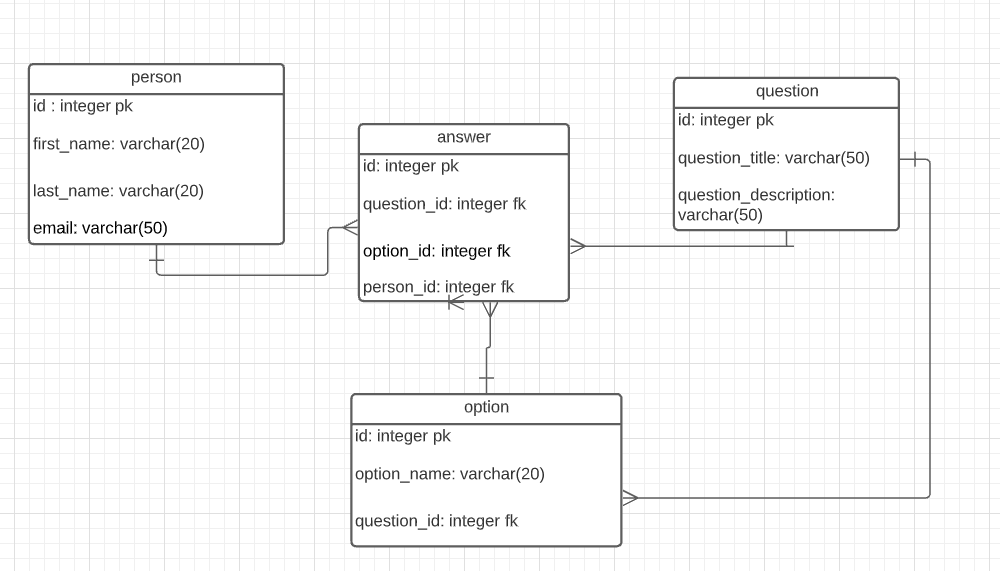
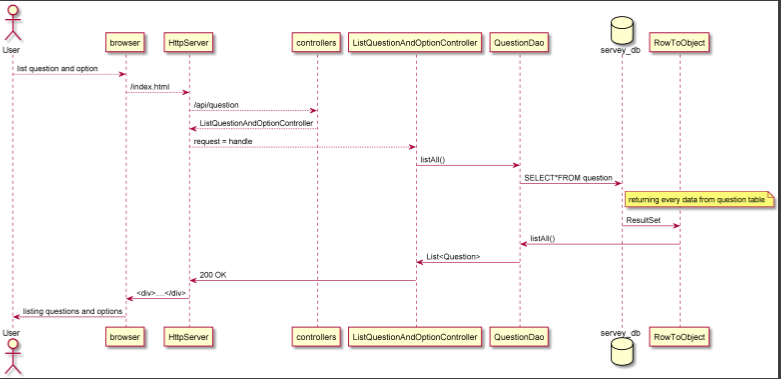

# PGR203 Avansert Java eksamen

## Beskriv hvordan programmet skal testes:

## Korreksjoner av eksamensteksten i Wiseflow:

**DET ER EN FEIL I EKSEMPELKODEN I WISEFLOW:**

* I `addOptions.html` skulle url til `/api/tasks` vært `/api/alternativeAnswers` (eller noe sånt)

**Det er viktig å være klar over at eksempel HTML i eksamensoppgaven kun er til illustrasjon. Eksemplene er ikke tilstrekkelig for å løse alle ekstraoppgavene og kandidatene må endre HTML-en for å være tilpasset sin besvarelse**

## Hvordan man kjører programmet
Først må man bygge en executable jar-fil:
* Kjør en mvn clean
* Kjør så en mvn package
* Så er det viktig å lage en pgr203.properties" med: 
  * dataSource.password=passordet til database eieren
  * dataSource.url=jdbc:postgresql://localhost:5432/'navnet på databasen'
  * dataSource.username=brukernavnet til eieren
* Skriv deretter i terminalen java -jar /target/prg203-axam-mgrinaker-1.0-SNAPSHOT.jar

Programmet skal brukes via en browser, vi har kun brukt browseren chrome. 
I urlen skal man skrive inn "http://localhost:1963/index.html".
Man vi da få opp en rekke spørsmål som skal besvarsel med svaralternativer. Men man på trykke på add knappen
for hvert svar som besvares for at det skal bli registrert.
Før man kan besvare spørmsålene er man nødt til å lage bruker, hvis ikke fungerer det ikke å svare.(Da krsæjer serveren).
Hvis man ønsker å redigere ett spørsmål er det mulighet for i navigationbar rett under overskriften. 
Der ser man også at det er mulighet for å legge flere svaralternativer på ett spørsmål hvis man ønsker det.

## Datamodell

## Ekstra leveranse utover minimum
Første gang man besøker undersøkelsen får de opp inputfelt der de må skrive inn opplysnigner om seg selv.

Hver gang brukeren har lagt inn ett nytt spørsmål eller ett nytt option blir brukeren sendt tilbake til index.html.
Dette ble gjort ved at vi startLine til "HTTP/1.1 303 See other" og location til "http://localhost:1963/index.html".

Vi har lagt inn UTF-8-decoding på alle inputfelt, sånn at både Æ, Ø, Å og @ skal bli lest inn og tolka riktig.

Der vi legger til brukerinformasjon i starten av surveyen har vi gjort sånn at navnet til brukeren lagres som en cookie.
Senere bruker vi denne cookien når brukeren registrerer svarene sine i surveyen, og kobler den opp mot personId i person-databasen.

I HttpServer har vi kode som leser filer fra disc, der den sjekker fil-endingene for å avgjøre hvilken content-type som
skal brukes. Det gjør det mulig å laste inn både .txt, .html og .css-filer riktig.

En abstractDao ble laget for å ikke få duplisert kode. Der har vi brukt generics for at de andre klassene kan få bruke 
metodene. Der har vi insert(), retrieve(), listAll() og update().

Hvis handleClient får "HTTP/1.1 500 Internal Server Error" så vil den skrive ut "Statuscode 500" til brukeren for å 
fortelle at serveren har kræsjet.
I tillegg har det blitt lagt inn at hvis brukeren skriver inn kun "/" eller har det blankt rett bak "localhost:1963" 
så vil de ble sendt rett til index.html.

I tab-vinduet har vi lagt inn ett lite favicon. Dette favicon ble kodet inn i alle html-filer i headeren.

Under datamodell har en illustrasjon over hvordan databasen og noen diagrammer over hvordan programmet vårt fungerer.
Vi føler vi har fått med oss de aller viktigste tabbellene som trengs for dette prosjektet. Vi kunne nok ha hatt med 
oss mere, som hvilken jobb de har og hvor de jobber. Dette ble ikke med grunnet at vi heller ønsket å fokusere på andre
oppgaver i dette prosjektet for å gjøre det bedre. 

## Sjekkliste

## Vedlegg: Sjekkliste for innlevering

* [x] Dere har lest eksamensteksten
* [ ] Dere har lastet opp en ZIP-fil med navn basert på navnet på deres Github repository
* [ ] Koden er sjekket inn på github.com/pgr203-2021-repository
* [x] Dere har committed kode med begge prosjektdeltagernes GitHub konto (alternativt: README beskriver arbeidsform)

### README.md

* [ ] `README.md` inneholder en korrekt link til Github Actions
* [x] `README.md` beskriver prosjektets funksjonalitet, hvordan man bygger det og hvordan man kjører det
* [x] `README.md` beskriver eventuell ekstra leveranse utover minimum
* [x] `README.md` inneholder et diagram som viser datamodellen

### Koden

* [ ] `mvn package` bygger en executable jar-fil
* [ ] Koden inneholder et godt sett med tester
* [ ] `java -jar target/...jar` (etter `mvn package`) lar bruker legge til og liste ut data fra databasen via webgrensesnitt
* [ ] Serveren leser HTML-filer fra JAR-filen slik at den ikke er avhengig av å kjøre i samme directory som kildekoden
* [x] Programmet leser `dataSource.url`, `dataSource.username` og `dataSource.password` fra `pgr203.properties` for å connecte til databasen
* [x] Programmet bruker Flywaydb for å sette opp databaseskjema
* [x] Server skriver nyttige loggmeldinger, inkludert informasjon om hvilken URL den kjører på ved oppstart

### Funksjonalitet

* [x] Programmet kan opprette spørsmål og lagrer disse i databasen (påkrevd for bestått)
* [x] Programmet kan vise spørsmål (påkrevd for D)
* [x] Programmet kan legge til alternativ for spørsmål (påkrevd for D)
* [x] Programmet kan registrere svar på spørsmål (påkrevd for C)
* [x] Programmet kan endre tittel og tekst på et spørsmål (påkrevd for B)

### Ekstraspørsmål (dere må løse mange/noen av disse for å oppnå A/B)

* [x] Før en bruker svarer på et spørsmål hadde det vært fint å la brukeren registrere navnet sitt. Klarer dere å implementere dette med cookies? Lag en form med en POST request der serveren sender tilbake Set-Cookie headeren. Browseren vil sende en Cookie header tilbake i alle requester. Bruk denne til å legge inn navnet på brukerens svar
* [x] Når brukeren utfører en POST hadde det vært fint å sende brukeren tilbake til dit de var før. Det krever at man svarer med response code 303 See other og headeren Location
* [x] Når brukeren skriver inn en tekst på norsk må man passe på å få encoding riktig. Klarer dere å lage en <form> med action=POST og encoding=UTF-8 som fungerer med norske tegn? Klarer dere å få æøå til å fungere i tester som gjør både POST og GET?
* [ ] Å opprette og liste spørsmål hadde vært logisk og REST-fult å gjøre med GET /api/questions og POST /api/questions. Klarer dere å endre måten dere hånderer controllers på slik at en GET og en POST request kan ha samme request target?
* [x] Vi har sett på hvordan å bruke AbstractDao for å få felles kode for retrieve og list. Kan dere bruke felles kode i AbstractDao for å unngå duplisering av inserts og updates?
* [x] Dersom noe alvorlig galt skjer vil serveren krasje. Serveren burde i stedet logge dette og returnere en status code 500 til brukeren
* [x] Dersom brukeren går til http://localhost:8080 får man 404. Serveren burde i stedet returnere innholdet av index.html
* [x] Et favorittikon er et lite ikon som nettleseren viser i tab-vinduer for en webapplikasjon. Kan dere lage et favorittikon for deres server? Tips: ikonet er en binærfil og ikke en tekst og det går derfor ikke an å laste den inn i en StringBuilder
* [ ] I forelesningen har vi sett på å innføre begrepet Controllers for å organisere logikken i serveren. Unntaket fra det som håndteres med controllers er håndtering av filer på disk. Kan dere skrive om HttpServer til å bruke en FileController for å lese filer fra disk?
* [x] Kan dere lage noen diagrammer som illustrerer hvordan programmet deres virker?
* [ ] JDBC koden fra forelesningen har en feil ved retrieve dersom id ikke finnes. Kan dere rette denne?
* [x] I forelesningen fikk vi en rar feil med CSS når vi hadde `<!DOCTYPE html>`. Grunnen til det er feil content-type. Klarer dere å fikse det slik at det fungerer å ha `<!DOCTYPE html>` på starten av alle HTML-filer?
* [ ] Klarer dere å lage en Coverage-rapport med GitHub Actions med Coveralls? (Advarsel: Foreleser har nylig opplevd feil med Coveralls så det er ikke sikkert dere får det til å virke)
* [ ] FARLIG: I løpet av kurset har HttpServer og tester fått funksjonalitet som ikke lenger er nødvendig. Klarer dere å fjerne alt som er overflødig nå uten å også fjerne kode som fortsatt har verdi? (Advarsel: Denne kan trekke ned dersom dere gjør det feil!)
